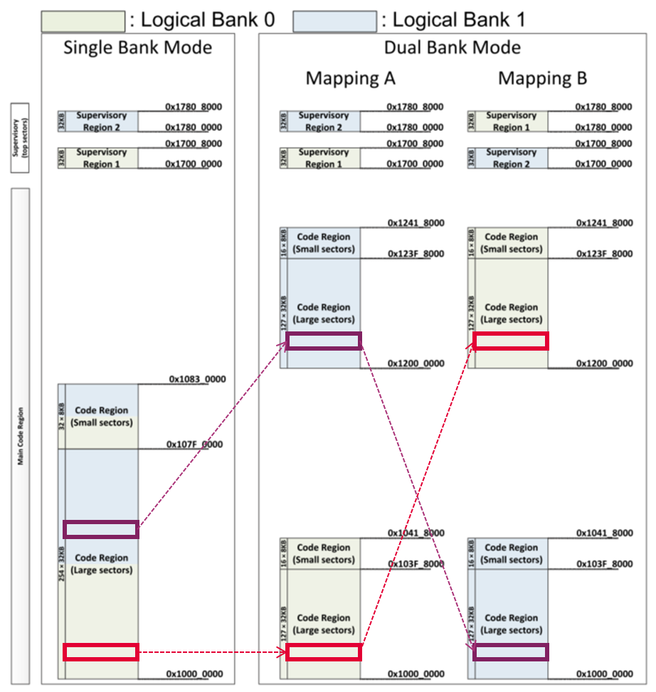
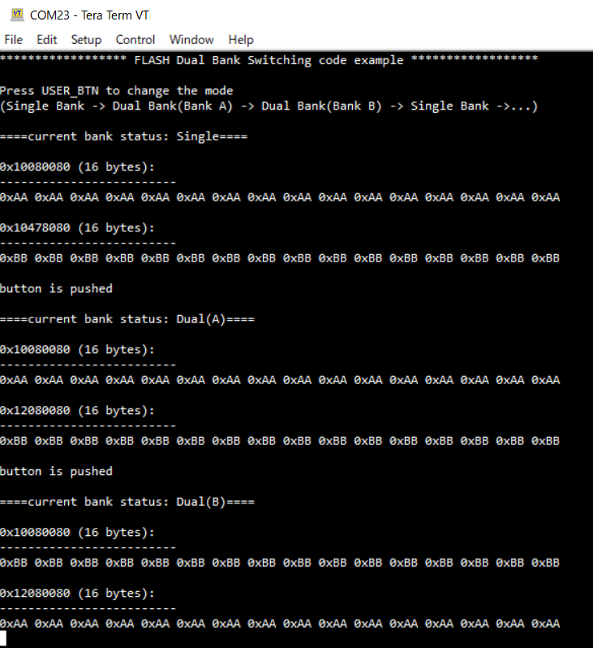

# FLASH Dual Bank Switching

**This code example shows how to switch the bank configuration of flash memory.**  

## Device

The device used in this code example (CE) is:

- [TRAVEO™ T2G CYT4BF Series](https://www.infineon.com/cms/en/product/microcontroller/32-bit-traveo-t2g-arm-cortex-microcontroller/32-bit-traveo-t2g-arm-cortex-for-body/traveo-t2g-cyt4bf-series/)

## Board

The board used for testing is:

- TRAVEO™ T2G evaluation kit ([KIT_T2G-B-H_EVK](https://www.infineon.com/cms/en/product/evaluation-boards/kit_t2g-b-h_evk/), [KIT_T2G-B-H_LITE](https://www.infineon.com/cms/en/product/evaluation-boards/kit_t2g-b-h_lite/))

## Scope of work
TRAVEO™ T2G MCUs have a Dual Bank mode in Code and Data Flash memory, where the area is divided into two banks in addition to the Single Bank mode used for normal mapping.
In Dual Bank mode, either logical bank 0 or 1 can be the active bank and the other side becomes the inactive bank by performing bank switching.
This feature allows for quick activation of the new firmware and rollback to the old firmware after a firmware rewrite via OTA (Over-The-Air). In addition, the new firmware can be written to the inactive bank while the application is running in the active bank, significantly reducing system downtime.
This CE shows how to switch the bank mode on code flash memory.

## Introduction  

**Code Flash**  

- Optional memory size: 4 MB, 6 MB, and 8 MB
- Programming and erasing functions
- ECC function: 64 bits + 8 bits
- Erase sector size of 32 KB for large sector and 8 KB for small sector
- Program size: 64 bits, 256 bits, and 4096 bits
- Supports Single Bank and Dual Bank modes
- Supports reading while programming/erasing
- 1,000 program/erase cycles
- Retention of 20 years

**Work Flash**  

- Optional memory size: 256 KB
- Programming and erasing functions
- ECC function: 32 bits + 7 bits
- Erase sector size is 2 KB for large sector and 128 bytes for small sector
- Program size: 32 bits
- Supports Single Bank and Dual Bank modes
- Supports reading while programming/erasing
- Supports differential sensing architecture
- 250,000 program/erase cycles
- Retention of 10 years

More details can be found in [Technical Reference Manual (TRM)](https://www.infineon.com/dgdl/?fileId=5546d4627600a6bc017600bfae720007), [Registers TRM](https://www.infineon.com/dgdl/?fileId=5546d4627600a6bc017600be2aef0004) and [Data Sheet](https://www.infineon.com/dgdl/?fileId=5546d46275b79adb0175dc8387f93228).

## Hardware setup

This CE has been developed for:
- TRAVEO™ T2G evaluation kit ([KIT_T2G-B-H_EVK](https://www.infineon.com/cms/en/product/evaluation-boards/kit_t2g-b-h_evk/)) 
 
No changes are required from the board's default settings.

- TRAVEO™ T2G Body High Lite evaluation kit ([KIT_T2G-B-H_LITE](https://www.infineon.com/cms/en/product/evaluation-boards/kit_t2g-b-h_lite/)) 
 
No changes are required from the board's default settings.

## Implementation

The figure below shows the overview of Code Flash bank modes on device that has 8MB Code Flash memory:  
In this CE, different data are placed at two addresses in Single-Bank mode (the red and purple rectangle in figure above) that would be the same address in Dual-Bank mode, and each data is checked to see at which address it appears in mapping A and mapping B in single-bank mode and dual-bank mode.

**Bank switching operation**  

- When changing the bank mode, it must be operated by a code located outside of the Code Flash. This is because a change in the value of a specific address due to bank mode switching may cause the program to perform an unintended operation. In this CE, *main()* and some functions which might be called by *main()* are located in internal SRAM.
- The bank mode is switched by two bits *MAIN_BANK_MODE* and *MAIN_MAP* in the *FLASHC_FLASH_CTL* register.
- After setting these to the appropriate values, the register should be read back to ensure that the write operation reaches the register from the write buffer.
- Then calling *__ISB()* to ensure that the already read instructions in CPU pipeline are discarded and setting *FLASHC_FLASH_CMD_INV* bit of *FLASHC_FLASH_CMD* to invalidate cache and buffers on flash memory.

**Miscellaneous settings**  

- **STDIO setting**
  - Calling [<i>cy_retarget_io_init()</i>](https://infineon.github.io/retarget-io/html/group__group__board__libs.html#ga21265301bf6e9239845227c2aead9293) function to use UART as STDIN/STDOUT
    - Initialize the pin specified by CYBSP_DEBUG_UART_TX as UART TX, the pin specified by CYBSP_DEBUG_UART_RX as UART RX (these pins are connected to KitProg3 COM port)
    - The serial port parameters become to 8N1 and 115200 baud

- **GPIO setting to use the user button**
  - Calling <a href="https://infineon.github.io/mtb-hal-cat1/html/group__group__hal__gpio.html#gab93322030909d3af6a9fc1a3b2eccbaa"><i>cyhal_gpio_init()</i></a> function to initialize GPIO as input mode to read the user button state
  - Calling <a href="https://infineon.github.io/mtb-hal-cat1/html/group__group__hal__gpio.html#ga3d38f1dd86c2e74b8ad10f1f6d1945c2"><i>cyhal_gpio_read()</i></a> to read out the button state

**Confirming bank switching result**  

- When the *main()* function detects that the user button has been pressed, it switches bank modes sequentially like this: Single Bank -> Dual Bank (mapping A) -> Dual Bank (mapping B) -> Single Bank ...
- You can see in the terminal how the addresses of the different data placed at the two addresses (the red and purple squares in the figure above) change in each bank mode.

## Run and Test

For this CE, a terminal emulator is required for displaying outputs and get inputs. Install a terminal emulator if you do not have one. Instructions in this document use [Tera Term](https://ttssh2.osdn.jp/index.html.en).

After code compilation, perform the following steps to flashing the device:

1. Connect the board to your PC using the provided USB cable through the KitProg3 USB connector.
2. Open a terminal program and select the KitProg3 COM port. Set the serial port parameters to 8N1 and 115200 baud.
3. Program the board using one of the following:
    - Select the CE project in the Project Explorer.
    - In the **Quick Panel**, scroll down, and click **[Project Name] Program (KitProg3_MiniProg4)**.
4. After programming, the CE starts automatically. Confirm that the messages are displayed on the UART terminal.

    - *Terminal output on program startup* 

5. You can debug the example to step through the code. In the IDE, use the **[Project Name] Debug (KitProg3_MiniProg4)** configuration in the **Quick Panel**. For details, see the "Program and debug" section in the [Eclipse IDE for ModusToolbox™ software user guide](https://www.infineon.com/dgdl/?fileId=8ac78c8c8386267f0183a8d7043b58ee).

**Note:** **(Only while debugging)** On the CM7 CPU, some code in *main()* may execute before the debugger halts at the beginning of *main()*. This means that some code executes twice: once before the debugger stops execution, and again after the debugger resets the program counter to the beginning of *main()*. See [KBA231071](https://community.infineon.com/t5/Knowledge-Base-Articles/PSoC-6-MCU-Code-in-main-executes-before-the-debugger-halts-at-the-first-line-of/ta-p/253856) to learn about this and for the workaround.

## References  

Relevant Application notes are:

- AN235305 - GETTING STARTED WITH TRAVEO™ T2G FAMILY MCUS IN MODUSTOOLBOX™
- [AN220242](https://www.infineon.com/dgdl/?fileId=8ac78c8c7cdc391c017d0d3b05c26796) - Flash accessing procedure for TRAVEO™ T2G family
- [AN229058](https://www.infineon.com/dgdl/?fileId=8ac78c8c7cdc391c017d0d3e8f7c67e6) - Secured firmware over-the-air (FOTA) update in TRAVEO™ T2G MCU

ModusToolbox™ is available online:
- <https://www.infineon.com/modustoolbox>

Associated TRAVEO™ T2G MCUs can be found on:
- <https://www.infineon.com/cms/en/product/microcontroller/32-bit-traveo-t2g-arm-cortex-microcontroller/>

More code examples can be found on the GIT repository:
- [TRAVEO™ T2G Code examples](https://github.com/orgs/Infineon/repositories?q=mtb-t2g-&type=all&language=&sort=)

For additional trainings, visit our webpage:  
- [TRAVEO™ T2G trainings](https://www.infineon.com/cms/en/product/microcontroller/32-bit-traveo-t2g-arm-cortex-microcontroller/32-bit-traveo-t2g-arm-cortex-for-body/traveo-t2g-cyt4bf-series/#!trainings)

For questions and support, use the TRAVEO™ T2G Forum:  
- <https://community.infineon.com/t5/TRAVEO-T2G/bd-p/TraveoII>  
